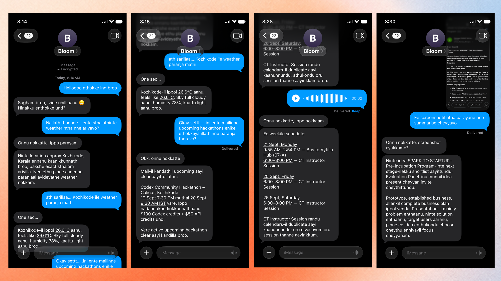

# bloom

## Overview

bloom is a personal assistant that knows your life and lives in the messaging app
you already use. You text it the way you text a friend — in English, Hindi,
Malayalam, or the romanised code-mix people actually type — and it answers in the
same language you used. It reads your mail, watches for things you are waiting on,
writes to your Reminders and Notes, sends calendar invites you tap to accept,
listens to voice notes and replies out loud, looks at photos you send, remembers
what you talked about weeks ago, and checks in when you said you would do
something and did not.

The intended shape is one assistant reachable from wherever you happen to be
writing — WhatsApp, iMessage, whatever comes next — backed by a hosted service
that holds your context. **iMessage is the channel implemented so far**, through a
local BlueBubbles server, and for this hackathon the whole pipeline runs on one
Mac rather than in the cloud.

There is no app to install and no website to log into: the interface is the
message thread you already have open.

## Problem Statement

Assistants live where you are not. Opening a tab, signing in, and typing a prompt
is a context switch, which is why most people only reach for one when they already
know they need it. The gap is worst for the things that would help most — someone
is waiting on a reply you forgot, a mail arrived that changes your day, you
promised a friend something on Tuesday and it is now Friday.

There is also a language problem. A large part of the world texts in romanised,
code-mixed Malayalam or Hindi — *"enikku naale oru meeting undu"*, *"bhai kal kya
plan hai"* — and assistants answer in English, or worse, in a script the person
does not read casually. Replying in Devanagari to someone typing Manglish is not
help, it is friction.

## Solution

bloom moves the assistant into the message layer, where the conversation already
is, instead of asking you to come to it.

Because it sits there, it can see things an assistant in a browser tab cannot:
which of your threads have someone waiting on a reply, what you promised and to
whom, what you have talked about before. That accumulated context is the product —
an assistant that knows your life well enough to be useful without being briefed
every time.

And because it answers in the language you wrote in — Roman script in, Roman
script out — it reads like a person rather than a product.

The same is true of what it can reach. App integrations are not written into
bloom; it asks Composio which ones are connected and offers those. Connecting a
new app is an account-level action, not a pull request, so the assistant's reach
grows without the code changing.

The messaging channel is deliberately a seam. Everything above it — the agent, the
tools, the memory, the watches — has no idea which app a message arrived from; a
channel implements `send` and `run` against a normalised `InboundMessage`. Adding
WhatsApp means writing another adapter beside `channels/bluebubbles.py`, not
reworking the assistant. In production that seam is also where the split happens:
the service is hosted, and only the channel bridge needs to sit near the user.

## Features

* **Answers in your language.** English, Hindi and Malayalam, in native script or
  romanised, including Hinglish and Manglish. Speech is transcribed in Roman
  script so a voice note reads back the way you would have typed it. Any other
  language is named and politely declined rather than answered badly.
* **Voice notes both ways.** Send one and it is transcribed and answered; the
  model decides when a spoken reply fits and sends one back as a real voice
  bubble.
* **Sees pictures.** Send a photo and ask about it. Images are shrunk, uploaded
  once, and referenced by id so a long conversation does not pay for them again
  each turn.
* **Connected apps — whatever you connect.** Apps come through Composio's tool
  router, which carries around a thousand of them: Gmail, Calendar, Notion,
  Slack, GitHub, Linear, Drive, Sheets, HubSpot and so on. bloom hardcodes none
  of them. It discovers whichever apps are set up and offers their actions, so
  connecting a new one makes it usable without a code change. An app you have not
  connected yet offers a sign-in link in the chat instead of failing.
* **Apple Reminders, Notes and Calendar.** Tasks and notes are written directly on
  the Mac; events arrive as a calendar invite you tap to add, which needs no
  approval because the tap is the decision.
* **Watches.** "Tell me when mail from X arrives" records a standing watch. It
  learns what is already there first, so only genuinely new things are reported,
  and a fired watch is written up — *"the residency is restarting, they want you
  to reapply"* — rather than relayed raw.
* **Who is waiting on you.** Reads your threads for conversations where someone
  wrote and got nothing back, with short codes, OTPs, delivery notices and
  promotions filtered out. On the test machine that turned 179 threads into one
  person actually waiting.
* **Promises kept.** Scans the messages you sent other people for commitments you
  made, and asks how it went once one is overdue. At most three times, six hours
  apart, and never again once you say it is done.
* **Morning briefing.** One catch-up a day drawing on your calendar, reminders,
  who is waiting and what you owe people — written as a few lines, in your
  language, and silent on a morning with nothing to say.
* **Recall.** Conversations and watch results are embedded and searchable by
  meaning, so "what did we decide on Tuesday" works without matching words.
* **An approval gate.** Anything that changes the world outside bloom — sending
  mail, creating things, deleting — is held for a one-word confirmation first.

## Tech Stack

* **Frontend:** iMessage. There is no custom UI; the message thread is the
  interface, reached through a local BlueBubbles server.
* **Backend:** Python 3.14, standard library only for the service itself — an
  HTTP webhook receiver, a REST poller, and background threads for watches and
  the daily briefing. No web framework.
* **Database:** SQLite on the laptop for conversation state, approvals,
  identities, watches and commitments. Pinecone (serverless, cosine, 1536
  dimensions) for the searchable memory.
* **APIs / Services:** OpenAI Responses API (`gpt-5.6-luna`) and
  `text-embedding-3-small`, plus the OpenAI Agents SDK for background task work;
  Composio Tool Router, which fronts roughly a thousand
  app integrations and is queried dynamically rather than wired to a fixed list;
  Sarvam AI for Indic speech-to-text and text-to-speech; BlueBubbles for iMessage;
  AppleScript for Reminders, Notes and Calendar.
* **Hosting / Deployment:** For the hackathon, entirely local: a `launchd` agent on
  one Mac, with SQLite on disk beside it. In production this pipeline is meant to
  be hosted — the agent, stores and schedulers as a service, with only the
  messaging bridge near the user. Nothing in the design assumes the laptop; it
  assumes one process with a database, which is why the move is a deployment
  change rather than a rewrite.
* **Other Tools:** `sips` for image resizing, `.ics` generation for calendar
  invites, `unittest` for the test suite.

## Codex / OpenAI Usage

**OpenAI models are the product, not just a build tool.** Every reply, every
decision about which tool to use, every watch write-up, briefing and check-in is a
Responses API call to `gpt-5.6-luna`. `text-embedding-3-small` powers recall.
Native tool calling drives the whole agent loop, and prompt caching keeps the cost
of a large tool surface manageable.

The model was also chosen by measurement rather than reputation. Five candidates
were benchmarked on this project's actual prompts, and `gpt-5.6-luna` won on both
accuracy and cost — 9/9 on the language matrix at 440 output tokens against
`gpt-5.4-mini`'s 8/9 at 967, for the same latency.

**The OpenAI Agents SDK** (`openai-agents`) backs the second layer: longer work
that does not fit in a single reply. `tasks/runner.py` builds an `Agent` with a
`function_tool` for local browser research and an SDK `SQLiteSession` holding that
task's state on disk, run on a long-lived event loop so a background task never
blocks the conversation. It is switched off by default behind
`BLOOM_BROWSER_TASKS`: the browser it drives is signed into nothing, and the model
kept reaching for it over the connected apps — answering "did I get mail from X"
by opening Gmail in a browser and hitting a login wall. The machinery is intact
and one environment variable away; what it needs is a browser with a real session,
which is the next thing to build rather than something to leave on.

AI assistance was used throughout the build itself: designing the architecture,
writing the code and its 125 tests, and — most usefully — debugging. A long list of
real faults were found and fixed this way, including a broken tool-calling loop
that made every tool call fail, a context overflow caused by unbounded tool
results, an approval flow that looped forever, and speech synthesis that had never
worked because of an invalid default voice.

## Demo

### Live Demo

There is no hosted demo, and there cannot be one: bloom runs on a specific Mac,
signed into a specific iMessage account, with that person's mail and calendar
connected. Running it means running it yourself, which the section below covers.

### Demo / Pitch Video

**[Watch the demo](https://youtube.com/shorts/UcOjsgrdoBM?feature=share)** —
bloom answering over iMessage, in the language it was written to.

## Screenshots



Four moments from one morning, left to right:

1. **It answers in the language you wrote in.** Manglish in, Manglish out — and it
   works out roughly where you are before answering a question about the weather,
   while saying plainly that the location is approximate.
2. **It reads your mail.** Asked which upcoming hackathons are in the inbox, it
   finds the Codex Community Hackathon, and says clearly that there were no others
   rather than padding the answer.
3. **It listens.** The blue bubble is a voice note; bloom transcribes it and
   answers with the week's calendar — including noticing that one session appears
   in two calendars and is probably a single event, not two.
4. **It looks at what you send.** A screenshot of an email, summarised into what
   actually matters: you have been shortlisted, here is what the panel expects,
   and a prototype is not required yet.

## How to Run Locally

bloom needs macOS, because it talks to iMessage through BlueBubbles and to
Reminders and Notes through AppleScript.

```bash
git clone https://github.com/harryfrzz/bloom.git
cd bloom
python3 -m venv .venv && .venv/bin/pip install -e ".[connectors,recall]"

cp .env.example .env     # then fill in OPENAI_API_KEY and BLOOM_MODEL
.venv/bin/python cli.py models   # lists the models your key can use

.venv/bin/python cli.py chat            # terminal conversation, no iMessage needed
.venv/bin/python cli.py serve-imessage  # the real thing
```

Before `serve-imessage`, install the [BlueBubbles server](https://bluebubbles.app)
and add a webhook pointing at `http://127.0.0.1:8787/bluebubbles/webhook`. Every
other key is optional and the matching feature simply stays switched off without
it: `COMPOSIO_API_KEY` for connected apps, `SARVAM_API_KEY` for voice,
`PINECONE_API_KEY` for recall. All settings are documented in `.env.example`.

```bash
.venv/bin/python -m unittest discover -s tests -t .   # 125 tests
```

## Additional Notes

**What is deliberately limited.** Indic language support is scoped to Hindi and
Malayalam. Romanised Tulu is occasionally mistaken for Manglish, which is a genuinely
hard distinction; Tamil, Telugu, Kannada and Bengali are reliably declined.
Reminders and Notes are written through AppleScript rather than sent as files,
because no file format reaches them reliably on Apple's side.

**Local is the hackathon, not the thesis.** Everything runs on one Mac here because
that was the fastest way to a working assistant in the time available, and because
iMessage access genuinely requires a Mac. The intended production shape is hosted:
the agent, the stores and the schedulers as a service, with the messaging bridge as
the only piece that must sit near the user. Some of that is already true — model
calls, connected apps and the vector memory are remote today — and the rest is a
deployment change rather than a redesign. The one piece that cannot move is the
iMessage bridge, which is a reason WhatsApp matters: it is the first channel that
would let the whole thing live in the cloud.

**Known rough edges.** BlueBubbles' own message listener stalls and only recovers on
a restart, so bloom polls its REST API alongside the webhook and deduplicates by
message id; without that, replies silently stop. The Private API is not enabled,
which would require disabling SIP, so sends go through AppleScript and there are no
typing indicators or tapbacks. Promises with no stated deadline are recorded but
never chased, which is deliberate restraint rather than an oversight.

**Licence.** Released under the [PolyForm Noncommercial License
1.0.0](https://polyformproject.org/licenses/noncommercial/1.0.0): free to use,
modify and share for any noncommercial purpose, including personal projects,
research, education and nonprofits. Commercial use requires a separate licence
from the author. Note that this is a source-available licence rather than an
OSI-approved open source one, precisely because it restricts commercial use.

**What is next.** WhatsApp as a second channel, which is both the most requested
surface and the one that frees the service from needing a Mac at all. Then group
chats — an assistant that lives in a friend group rather than a one-to-one thread.
Reading an event poster from a photo straight into a calendar invite. Drafting the
replies for the people found waiting, rather than only listing them.

A caveat on the channel seam, since it is easy to overclaim: `send` and `run` are
all a channel must implement, but iMessage-specific work sits outside that protocol
too — attachments, contact lookup, reading who is waiting on a reply. A WhatsApp
adapter would reach parity in stages rather than in one file.
